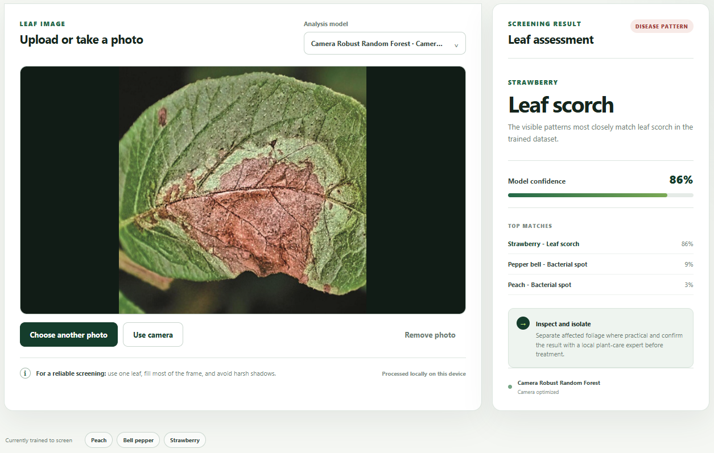
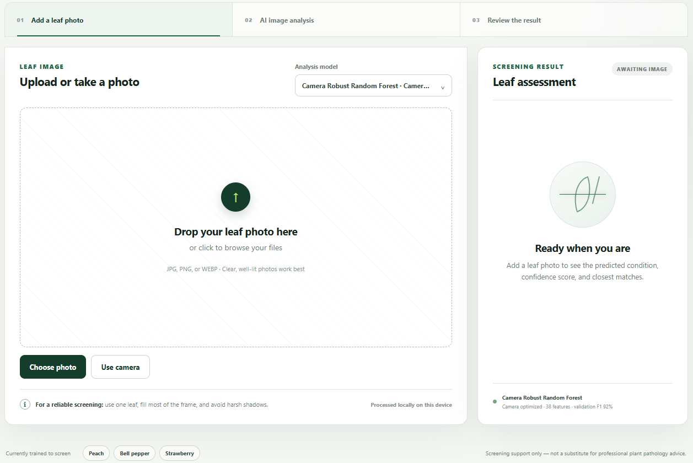
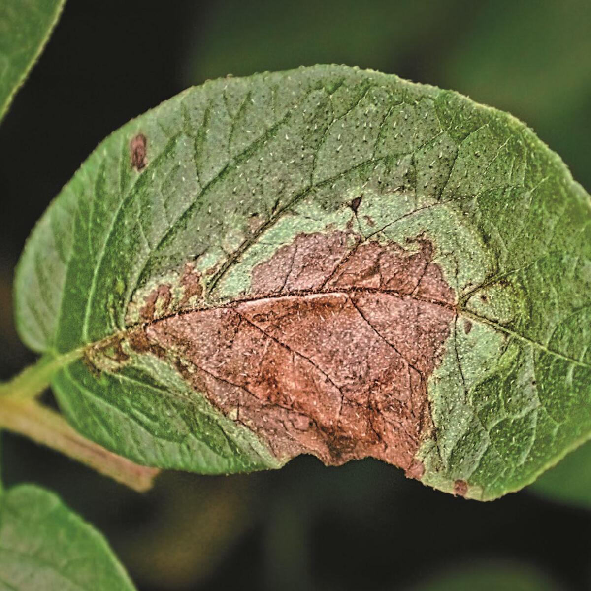
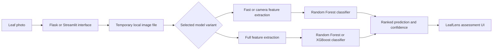

<div align="center">


# LeafLens

### Plant disease screening from leaf images using classical computer vision and ensemble machine learning

LeafLens helps users upload or capture a leaf photo, then returns a ranked screening result for supported peach, bell pepper, and strawberry conditions.

[Live demo](https://appapppy-ggcd4xhaxeb42jzvaw6rcp.streamlit.app/) · [Source code](https://github.com/LecyLecy/plant-leaf-disease-classifier) · [Notebook](Plant_Disease_Classification_CV.ipynb)

</div>



## Overview

LeafLens is an end-to-end computer vision application for screening visible plant-leaf conditions from a photograph. It turns an image into interpretable handcrafted features, evaluates those features with trained ensemble models, and presents a clear prediction, confidence score, and top alternative matches.

The project focuses on a practical interaction: add one clear leaf image, select an analysis model, and review the result. Flask provides the local web experience, while a Streamlit interface provides a deployed demo. Both front ends use the same feature-extraction and model-inference package.

> **Photo tip:** use one clear, well-lit leaf that fills most of the frame for the most reliable screening.

## Application flow

| Upload state | Input example | Assessment result |
| --- | --- | --- |
|  |  |  |
| Choose or capture a photo. | A leaf image is prepared for analysis. | The interface returns the predicted class, confidence, and closest matches. |

## What users can do

- Upload JPG, PNG, or WEBP leaf photographs by file picker or drag and drop.
- Use an in-browser camera workflow for a new photo.
- Choose between camera-focused, fast, and full-detail model bundles.
- Receive a predicted condition, confidence score, and the top three class matches.
- Review a purpose-built result state that separates healthy and disease-pattern outcomes.
- Run the Flask interface locally, or explore the Streamlit deployment online.

## Supported classes

| Crop | Conditions included in the trained model |
| --- | --- |
| Peach | Healthy, bacterial spot |
| Bell pepper | Healthy, bacterial spot |
| Strawberry | Healthy, leaf scorch |

## How it works



### Image preparation and feature engineering

The project deliberately uses classical image processing instead of a deep neural network. This keeps the pipeline inspectable, lightweight enough for local inference, and useful for demonstrating the relationship between visible plant symptoms and model inputs.

**Fast and camera variants, 38 features**

- Resize images to 96 × 96 pixels and apply median plus Gaussian filtering.
- Build a leaf mask from HSV saturation and brightness. The camera variant adds a green-aware mask with a fallback for challenging lighting.
- Estimate spot area and dark-leaf ratio using saturation, hue, and brightness thresholds.
- Extract RGB and HSV statistics, grayscale gradient texture statistics, and an eight-bin hue histogram.

**Full variant, 42 features**

- Resize images to 224 × 224 pixels, then apply Gaussian and median denoising.
- Construct a cleaned leaf mask with HSV thresholds and morphological opening and closing.
- Segment possible disease regions by combining Otsu thresholding on Lab color channels with K-means clustering of Lab a/b pixels.
- Measure lesion area, spot count, and largest lesion ratio.
- Compute HSV and Lab color moments, GLCM texture measures, and a local binary pattern histogram.

Feature vectors are reindexed against the saved model schema and invalid values are replaced before prediction. This prevents a feature-order mismatch between training and inference.

### Model design

The repository contains four serialized model bundles, each with its classifier, label encoder, feature-column order, validation metrics, and metadata. `ModelBundle` loading also includes a portable unpickler so models saved on Windows or POSIX systems can be loaded across environments.

- **Camera Robust Random Forest**: trained for camera input with original, blurred, and phone-like image augmentations. It is the default application choice because the interface is primarily designed for photographs.
- **Fast Random Forest**: a smaller 38-feature option for quicker screening.
- **Full Random Forest**: a 42-feature baseline using richer lesion and texture information.
- **Full XGBoost**: the highest-scoring bundle on the held-out validation features.

For camera models, the inference layer applies a small safety-oriented adjustment: when a healthy prediction is close to a disease prediction for the same plant, it can prioritize the nearby disease candidate rather than present a borderline healthy result.

## Validation results

The saved bundles report the following validation metrics. These results describe the repository's held-out validation data, not a guarantee of performance on every field photo, lighting condition, crop variety, or disease outside the six supported classes.

| Model | Variant | Features | Accuracy | Weighted F1 |
| --- | --- | ---: | ---: | ---: |
| Camera Robust Random Forest | Camera | 38 | 91.67% | 91.63% |
| Fast Random Forest | Fast | 38 | 91.67% | 91.59% |
| Full Random Forest | Full | 42 | 97.32% | 97.32% |
| Full XGBoost | Full | 42 | **98.55%** | **98.55%** |

The full pipeline improves validation performance by combining lesion geometry, color distributions, and texture descriptors. The camera-focused model trades some validation score for augmentations and masking choices intended to better accommodate phone-style inputs.

## Technology

| Area | Tools |
| --- | --- |
| Interfaces | Flask, Streamlit, HTML, CSS, JavaScript |
| Image processing | OpenCV, Pillow |
| Data processing | NumPy, pandas |
| Modeling | scikit-learn, XGBoost |
| Testing | Python `unittest` |
| Deployment | Streamlit Community Cloud |

## Repository structure

```text
app.py                          Flask application and prediction API
streamlit_app.py                Streamlit deployment entry point
plant_classifier/
  features.py                   Image preparation, segmentation, and feature extraction
  model_store.py                Model bundle loading, ranking, and inference safeguards
models/                         Serialized trained model bundles
scripts/
  train_pickles.py              Fast and full model training workflow
  train_camera_robust_pickle.py Camera-focused training and augmentation workflow
templates/                      Flask HTML templates
static/                         Styles, browser behavior, and LeafLens icon
tests/                          Feature, bundle, and Flask API tests
docs/images/                    README screenshots and example input image
```

## Run locally

Use Python 3.12 and a virtual environment. The pinned scikit-learn and XGBoost versions help keep serialized-model inference reproducible.

```powershell
py -3.12 -m venv .venv
.\.venv\Scripts\python -m pip install -r requirements.txt
.\.venv\Scripts\python app.py
```

Open [http://127.0.0.1:5000](http://127.0.0.1:5000).

To run the Streamlit interface instead:

```powershell
.\.venv\Scripts\streamlit run streamlit_app.py
```

## Testing and validation

Run the included test suite with:

```powershell
.\.venv\Scripts\python -m unittest discover -s tests -v
```

The suite currently validates:

- Green leaf masking against a skin-toned background.
- Feature-column reordering and confidence reporting at inference time.
- Camera-model handling of near-tied healthy and disease predictions.
- Model selection in the Flask API.
- Cross-platform loading of serialized model bundles.

## Limitations

- The classifier is trained only for six classes across three crops.
- Validation data and real field photographs can differ in lighting, focus, background, leaf age, and symptom severity.
- The output is an educational screening result, not a diagnosis from a plant pathologist.
- No confidence threshold or abstention class is implemented for images outside the training distribution.

## Future improvements

- Add more crops, diseases, and real field-image data.
- Evaluate with calibration metrics and introduce an "uncertain" outcome for low-confidence predictions.
- Add confusion matrices and per-class precision and recall reports to the repository.
- Compare the handcrafted-feature approach with a fine-tuned convolutional or vision-transformer model.
- Store anonymized opt-in prediction feedback to support future error analysis.

## Data and attribution

The training scripts reference a local copy of **New Plant Diseases Dataset (Augmented)**. The repository uses six selected folders from its train and validation splits. The original data package is not included in this repository, and no upstream source URL is recorded in the codebase.

The screenshots and disease example in `docs/images/` document the LeafLens interface and an example input workflow.

## License


No license file is currently included in the repository.
